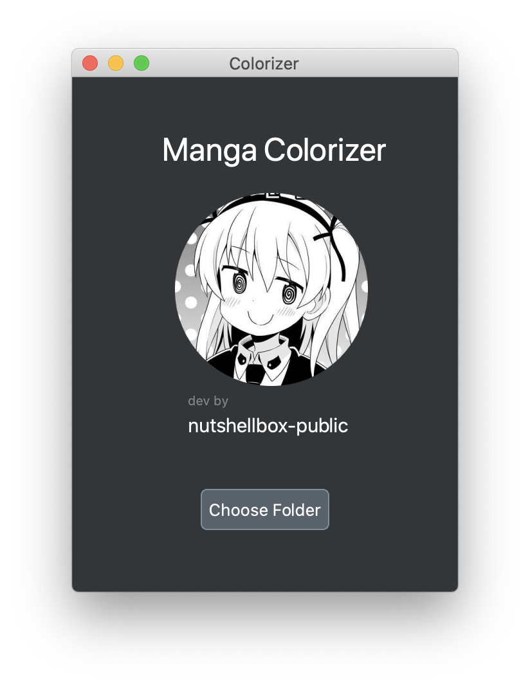
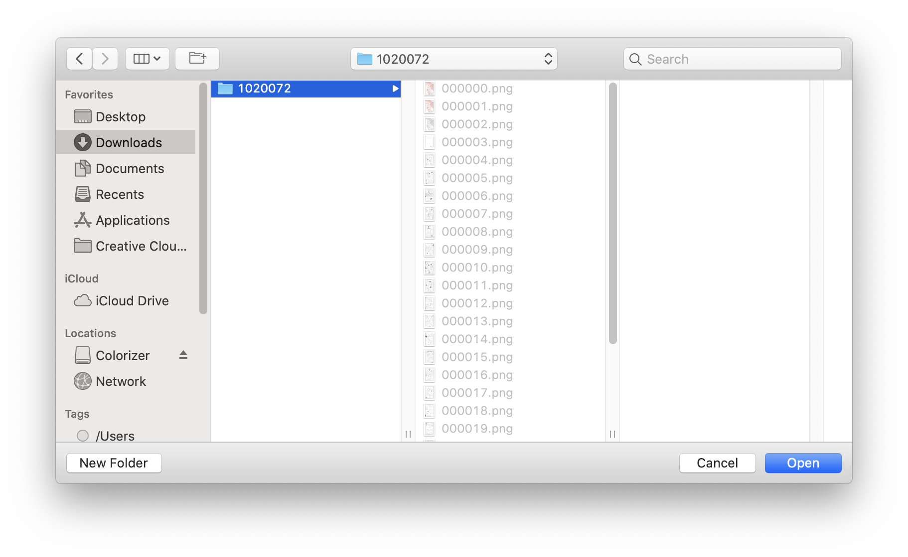
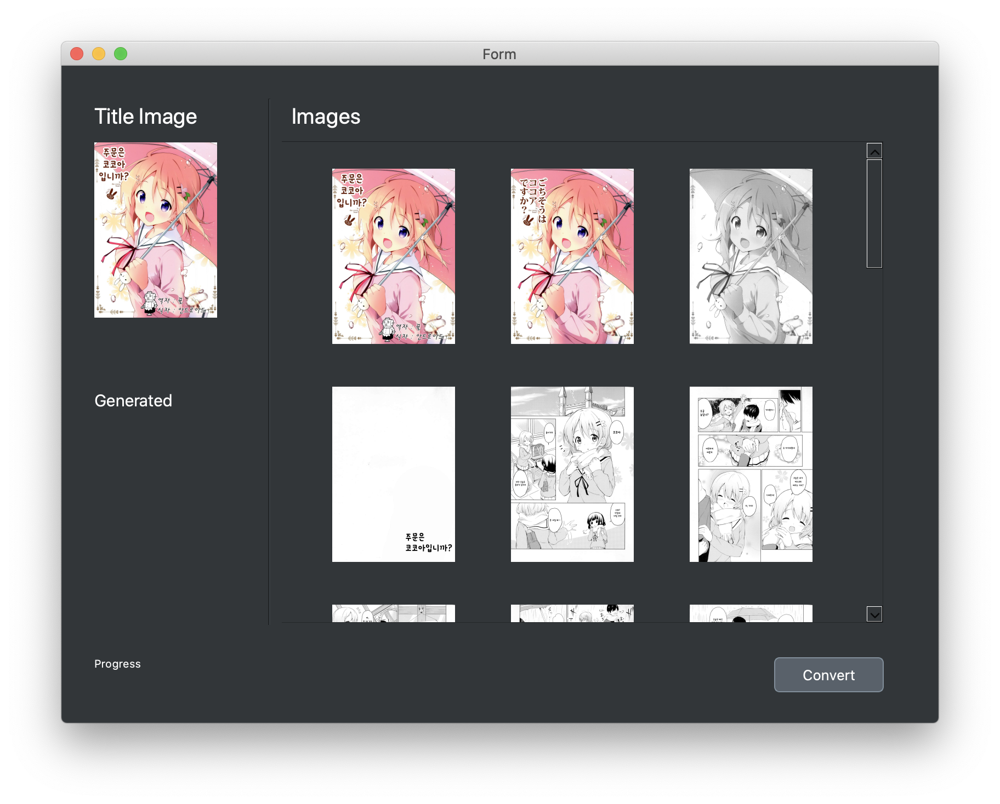
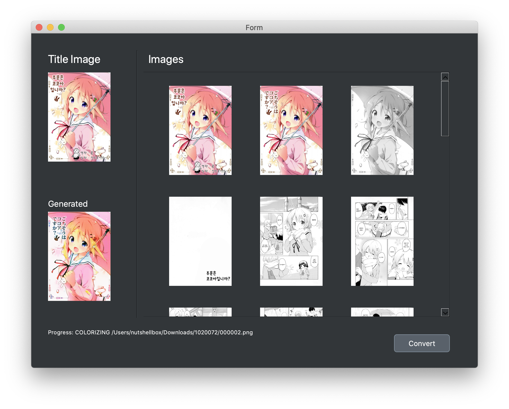
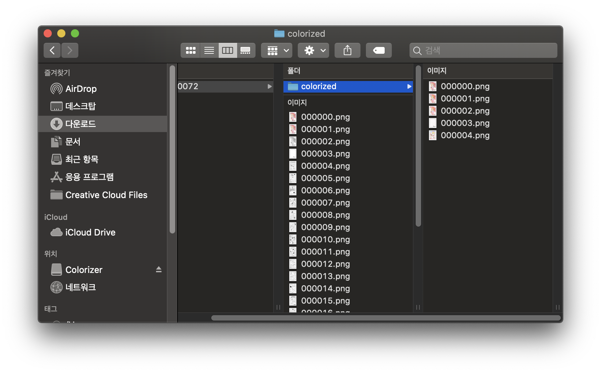

# Manga Colorizer

### 1. 개요

해당 프로그램은 흑백 만화를 컬러 만화로 변환해주는 역할을 합니다. Pix2Pix 네트워크 구조를 개량해서 제작하였습니다. 참고한 자료는 https://arxiv.org/pdf/1908.05840.pdf 와 https://github.com/lllyasviel/style2paints/blob/master/papers/sa.pdf 입니다. 구체적인 제작 과정은 제 블로그 https://blog.nutshellbox.com/ 에서 읽으실 수 있습니다.

### 2. 사용방법

빌드된 항목은 [여기](https://github.com/nutshellbox-public/colorizer/releases) 에서 다운받을 수 있습니다. 윈도우용 응용프로그램은 추후 생성하겠습니다.  빌드된 앱을 실행하시면 아래와 같은 창을 보실 수 있습니다. 실행 시 오버헤드가 큰 편이라 로딩이 있을 수 있습니다.

이곳에서 Choose Folder 항목을 클릭하면 폴더를 선택할 수 있는 창이 나타날 것입니다. 

이곳에 만화가 있는 폴더를 클릭하고 Open을 누릅니다.

그러면 아래와 같은 창이 뜨게 될 것입니다. 만약 타이틀 이미지가 원하는 타이틀 이미지가 아닐 경우 옆 이미지중 아무거나 클릭하면 클릭한 항목이 타이틀 이미지로 지정됩니다.

Convert버튼을 누르면 변환이 시작되고, Generated 항목엔 현재 생성중인 이미지를, Progress에는 작업 메세지가 표시됩니다. 변환된 이미지는 선택한폴더/colorize 에 저장됩니다.

변환이 완료될 시 해당 폴더가 열리게됩니다.

### 3. 참고사항

아직은 완벽하게 마무리가 된 프로젝트가 아니라 미흡한 점이 있습니다. 현재 이미지는 (896, 1280) 해상도의 만화만 지원합니다. 따라서 넙적한 만화나 길쭉한 만화는 지원되지 않습니다.
해상도가 딸려서 글자가 깨져보이거나 변형되어 보일 수 있습니다. 이것은 추후 수정하겠습니다.

감사합니다.
